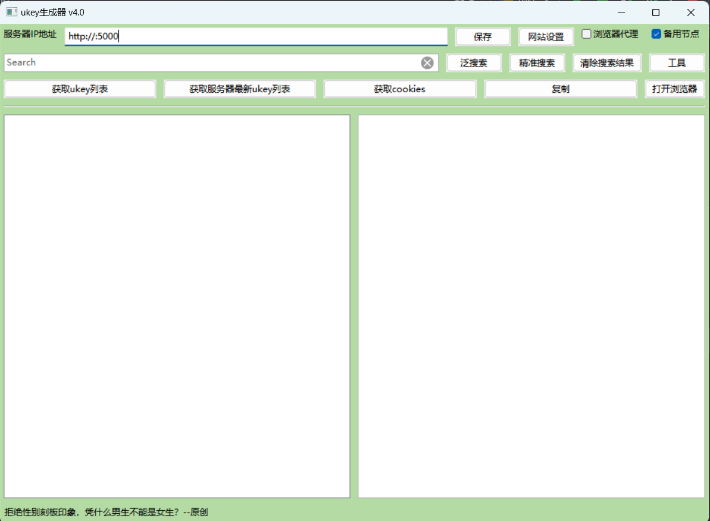
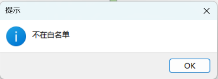
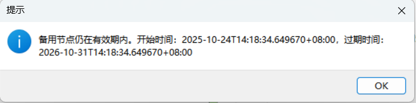

# 🚀 全国电力交易系统 UKey 自动登录辅助工具

> 支持 27 省电力交易系统 + 瑞数 5 省 + 广西交易系统  
> 客户端：wxPython + Flask，服务端：FastAPI（规划中）


---

## 目录

- [项目背景](#项目背景)
- [功能特性](#功能特性)
- [技术栈](#技术栈)
- [截图展示](#截图展示)
- [部署说明](#部署说明)
- [TODO List](#todo-list)
- [免责声明](#免责声明)
- [贡献](#贡献)
- [联系方式](#联系方式)

---

## 项目背景

公司现有的商业自动登录插件在扩展性和可维护性方面存在不足。  
因此利用业余时间，基于业务和需求难点开发了本项目
旨在提供一套可扩展、可部署、易维护的 UKey 自动登录辅助工具。

---

## 功能特性

### UKey 支持
- 支持录入、管理多条 UKey 信息
- 支持国网 27 省
- 支持瑞数防护的 5 省
- 支持广西交易系统

### 客户端功能
- wxPython（wxFormBuilder）
- 本地 Flask 服务
- 自动打开浏览器 + 代理注入

### 安全与鉴权
- MAC 地址绑定
- 开始时间 / 过期时间

---

## 技术栈
- wxPython  
- Flask  
- FastAPI（规划）  
- Windows / Linux 服务端

---

## 截图展示

客户端主界面：



鉴权页面：



鉴权时间控制：



---

## 部署说明

### 服务端

```bash
git clone https://github.com/jwmycz/UkeyLoginTools.git
cd server
python -m venv venv
source venv/bin/activate
pip install -r requirements.txt
uvicorn main:app --host 0.0.0.0 --port 8000
```

---

## TODO List

### 服务端
- 重构至 FastAPI
- 基于wxpython的后台管理界面
- 可视化 UKey 管理
- 云端配置
- 瑞数维护

### 客户端
- 配置下发
- 更新瑞数配置
- UI 美化
- 日志上报
- 自动更新

---

## 免责声明

本工具仅用于内部研究与工作效率提升，不得用于非法用途。

---

## 反馈

反馈：通过 issue 处理
